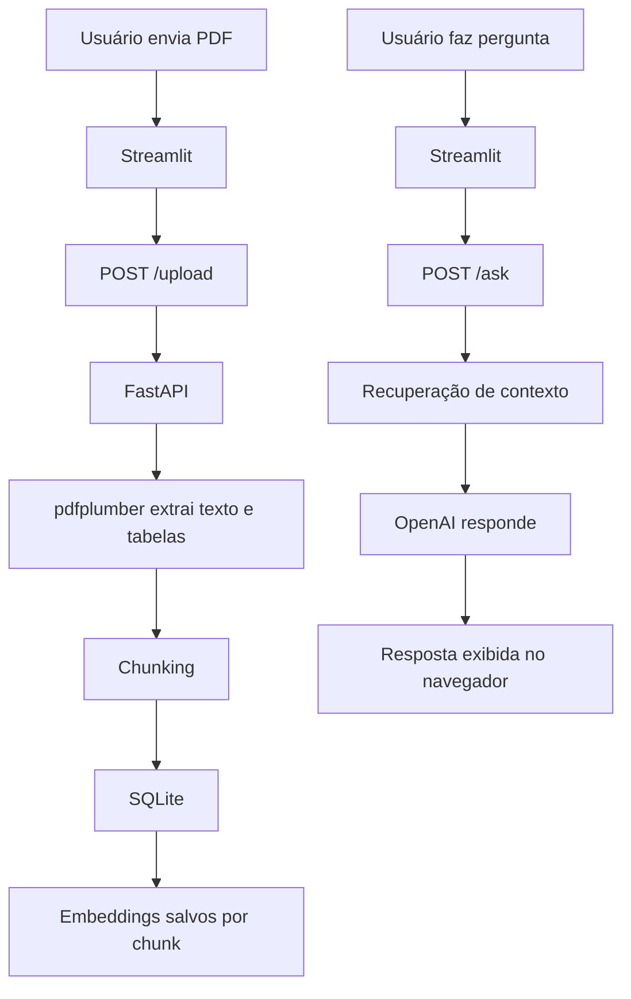
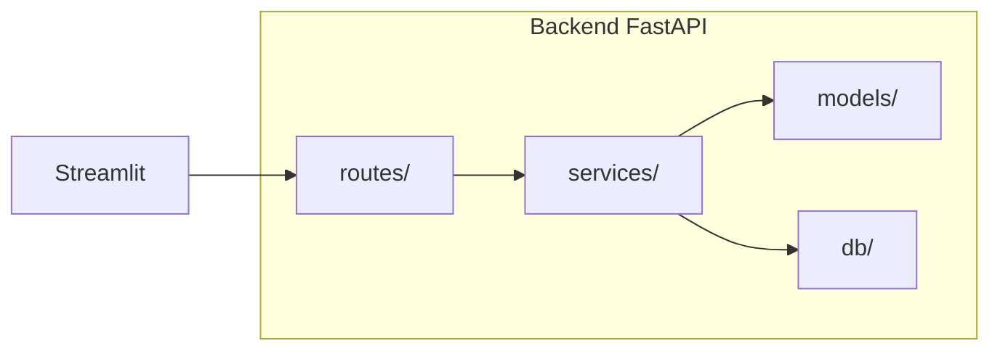

# Analisador de Relatórios Financeiros

API em FastAPI para receber PDFs de relatórios financeiros, extrair texto e tabelas, responder perguntas em linguagem natural e gerar análises estruturadas. O projeto também inclui uma interface em Streamlit para facilitar a demonstração em portfólio.

## Visão Geral

Este projeto foi pensado para analisar documentos como:

- balanço patrimonial
- DRE
- relatórios gerenciais
- PDFs com tabelas e texto financeiro

O fluxo principal é simples:

1. o usuário envia um PDF;
2. a API extrai o conteúdo;
3. o texto é salvo e organizado;
4. o usuário faz uma pergunta ou pede uma análise;
5. o sistema recupera o contexto relevante e devolve a resposta.

## Fluxo da Aplicação



## Arquitetura Interna



## Destaques

- Upload de PDF com validação de tipo e tamanho
- Extração de texto e tabelas com `pdfplumber`
- Endpoint para perguntas em linguagem natural
- Persistência com SQLite via SQLAlchemy
- Chunking do texto para melhorar a recuperação de contexto
- Embeddings e busca semântica para RAG
- Análises estruturadas com métricas financeiras
- Comparação entre dois relatórios
- Interface visual com Streamlit para demo sem Postman

## Funcionalidades

### `POST /upload`
Recebe um PDF, extrai o conteúdo e cria um identificador interno do documento.

### `POST /ask`
Recebe `document_id` e `question`, busca os trechos mais relevantes e devolve uma resposta em linguagem natural.

### `POST /analyze`
Extrai métricas financeiras estruturadas, como receita, EBITDA, lucro e dívida, além de indicadores derivados.

### `POST /compare`
Compara dois relatórios e retorna diferenças relevantes de forma estruturada.

## Interface Visual

O projeto inclui uma interface em Streamlit para demonstrar o fluxo sem depender de Swagger ou Postman.

- upload do PDF no navegador
- campo para pergunta
- resposta exibida na tela
- comunicação com a API local ou remota via `API_BASE_URL`

## Arquitetura

O código está organizado por responsabilidade:

- `app/routes/` contém os endpoints da API
- `app/services/` contém a lógica de negócio
- `app/models/` contém schemas Pydantic
- `app/db/` contém a camada de persistência
- `tests/` contém os testes automatizados

Essa separação reduz acoplamento e facilita manutenção, testes e evolução do projeto.

## Tecnologias

- FastAPI
- Uvicorn
- pdfplumber
- OpenAI API
- SQLAlchemy
- SQLite
- tiktoken
- NumPy
- Pydantic
- pytest
- Streamlit

## Como rodar localmente

### 1. Criar e ativar o ambiente virtual

```powershell
python -m venv .venv
Set-ExecutionPolicy -Scope Process -ExecutionPolicy Bypass
.\.venv\Scripts\Activate.ps1
```

### 2. Instalar dependências

```powershell
pip install -r requirements.txt
```

### 3. Configurar variáveis de ambiente

Crie um arquivo `.env` com base em `.env.example` e preencha sua chave da OpenAI:

```env
OPENAI_API_KEY=sk-sua-chave-aqui
OPENAI_CHAT_MODEL=gpt-5.4-mini
OPENAI_EMBEDDING_MODEL=text-embedding-3-small
API_BASE_URL=http://localhost:8000
APP_API_KEY=uma-chave-qualquer-para-o-backend
```

Observação:

- a `.env` real não deve ser commitada
- o arquivo `.env.example` serve como referência para configuração

### 4. Subir a API

```powershell
python -m uvicorn app.main:app --reload
```

### 5. Subir a interface Streamlit

Em outro terminal:

```powershell
streamlit run streamlit_app.py
```

## Variáveis de Ambiente

- `OPENAI_API_KEY`: chave da OpenAI
- `OPENAI_CHAT_MODEL`: modelo usado para responder perguntas
- `OPENAI_EMBEDDING_MODEL`: modelo usado para embeddings
- `API_BASE_URL`: URL da API FastAPI
- `APP_API_KEY`: chave usada entre Streamlit e API

## Banco de Dados

O projeto usa SQLite local no arquivo `financial_reports.db`.

O banco armazena principalmente:

- documentos enviados
- chunks do texto extraído
- embeddings associados aos chunks

## Estrutura do Projeto

```text
app/
├── db/
├── models/
├── routes/
├── services/
└── main.py
tests/
streamlit_app.py
requirements.txt
Dockerfile
README.md
```

## Docker

### Build

```powershell
docker build -t analisador-relatorios-financeiros .
```

### Run

```powershell
docker run --rm -p 8000:8000 --env-file .env analisador-relatorios-financeiros
```

## Deploy

O projeto foi preparado para deploy em Railway com suporte a:

- Dockerfile
- variáveis de ambiente
- API pública consumida pela interface Streamlit

## Roadmap

Próximos passos naturais para evolução do projeto:

- autenticação por API key no nível de produção
- observabilidade e logs melhores
- deploy automatizado
- melhorias de UI
- suporte a mais tipos de relatório

## Por que este projeto é relevante

Este repositório mostra competências que costumam ser valorizadas em backend e IA aplicada:

- design de API
- validação de arquivos
- processamento de documentos
- persistência com banco relacional
- recuperação semântica de contexto
- integração com LLM
- interface simples para demonstração
- organização em camadas

## Licença

Projeto pessoal para estudo, portfólio e experimentação técnica.
